# Pemrograman-Integratif-A-Bab-4_215150707111010_Salman-Ghozy-Nashrullah

<h1>Langkah Percobaan</h1>
<h2>Basic Routing dan Migration</h2>
<h2>GET</h2>
<h3>Langkah ke-1</h3>

 Untuk menambahkan <i>endpoint</i> dengan <i>method GET</i> pada aplikasi kita, kita dapat
mengunjungi <i>file web.php</i> pada <i>folder routes</i>. Kemudian tambahkan <i>$router->get('/get', function () {
return 'GET';
});</i> pada akhir
file

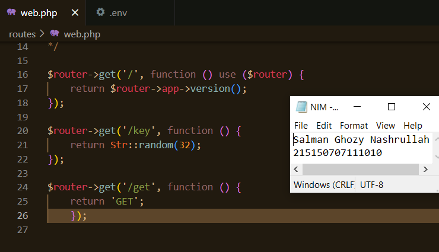

<h3>Langkah ke-2</h3>

Setelah itu coba jalankan aplikasi dengan <i>command, php -S localhost:8000 -t public</i>

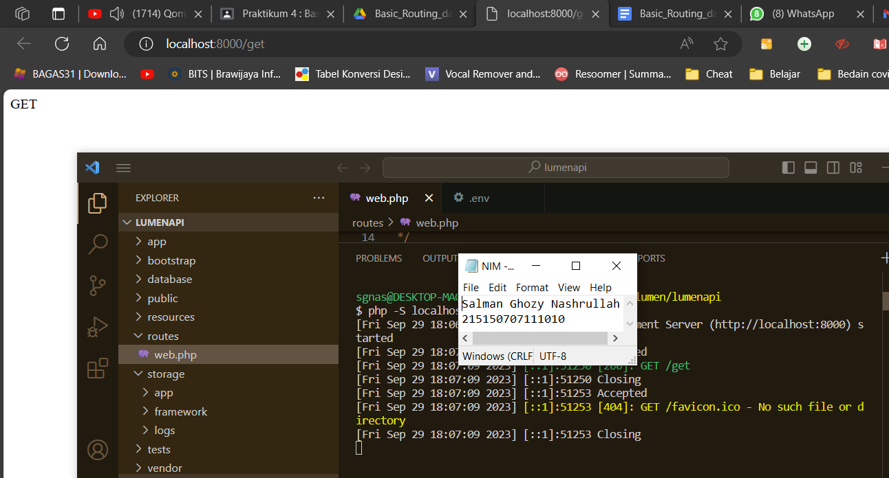

<h3>Langkah ke-3</h3>

Setelah aplikasi berhasil dijalankan, kita dapat membuka browser dengan <i>url, http://localhost:8000/get, path</i> yang akan kita akses akan berbentuk demikian,<i> http://{BASE_URL}{PATH}</i>, jika <i>BASE_URL</i> kita adalah <i>localhost:8000</i> dan <i>PATH</i> kita adalah <i>/get</i>, maka <i>url</i> akan berbentuk seperti diatas.

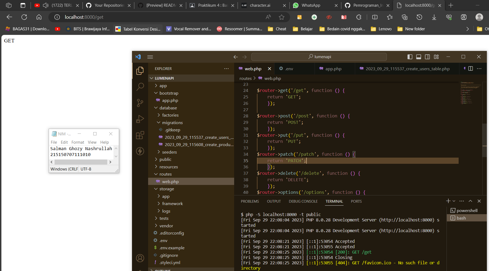

<h2>POST, PUT, PATCH, DELETE, dan OPTIONS</h2>
<h3>Langkah ke-1</h3>

Sama halnya saat menambahkan <i>method GET</i>, kita dapat menambahkan metode <i>POST, PUT, PATCH, DELETE, dan OPTIONS</i> pada <i>file web.php</i> dengan code seperti ini
<i>$router->post('/post', function () {

return 'POST';

});

$router->put('/put', function () {

return 'PUT';

});

$router->patch('/patch', function () { return 'PATCH';

});

$router->delete('/delete', function () { return 'DELETE';

});

$router->options('/options', function () { return 'OPTIONS';

});</i>

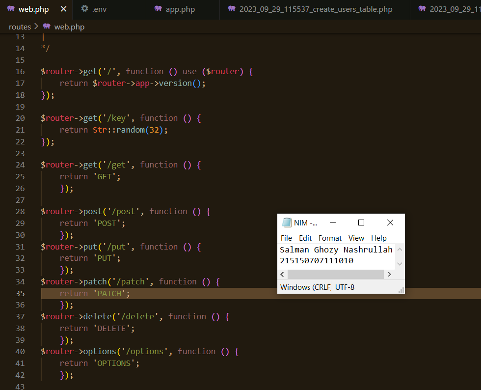

<h3>Langkah ke-2</h3>

pada percobaan kali ini kita akan menggunakan <i>extensions</i> pada <i>VSCode</i> yaitu <i>Thunder Client</i>.

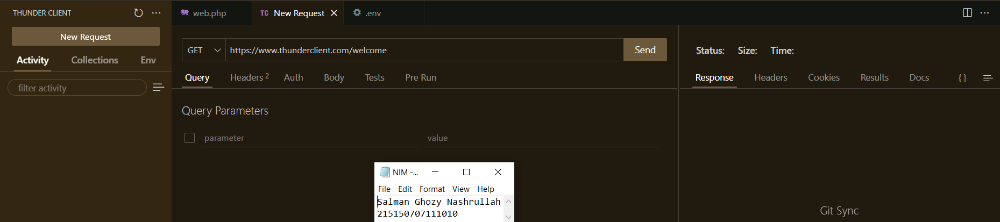

<h3>Langkah ke-3</h3>

Mengakses <i>url http://[::1]:8000/get</i> pada <i>Thunder Client</i>

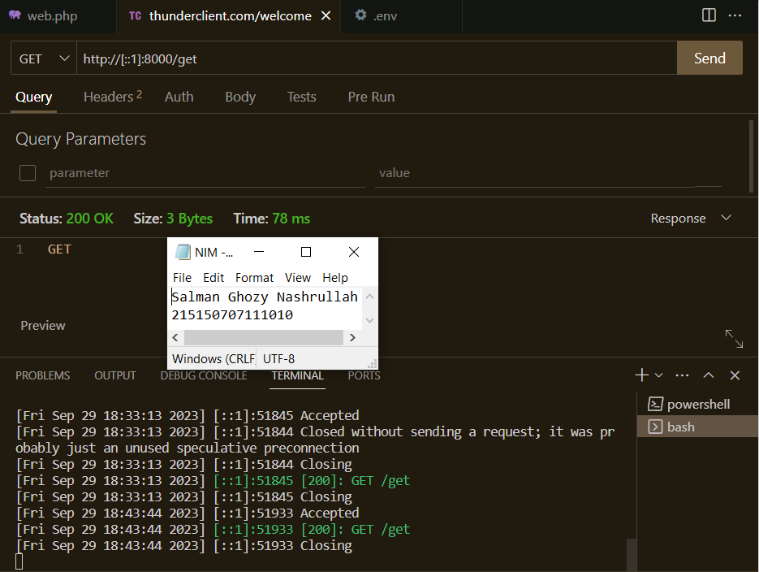

<h2>Koneksi Express ke MongoDB</h2>
<h3>Langkah ke-1</h3>

Mengakses <i>url http://[::1]:8000/post</i> pada <i>Thunder Client</i>

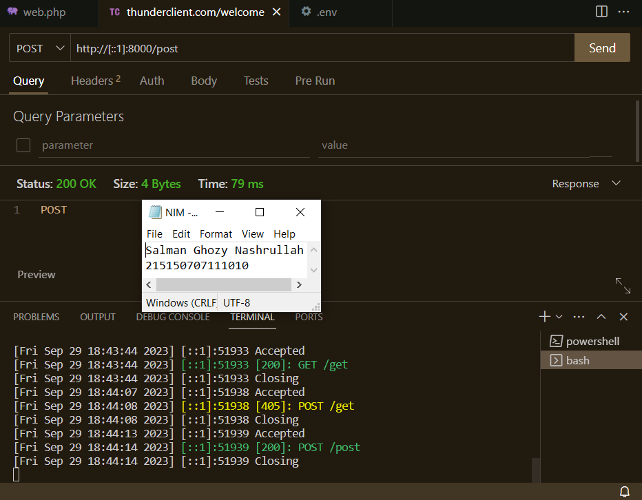

<h3>Langkah ke-2</h3>

Mengakses <i>url http://[::1]:8000/put</i> pada <i>Thunder Client</i>

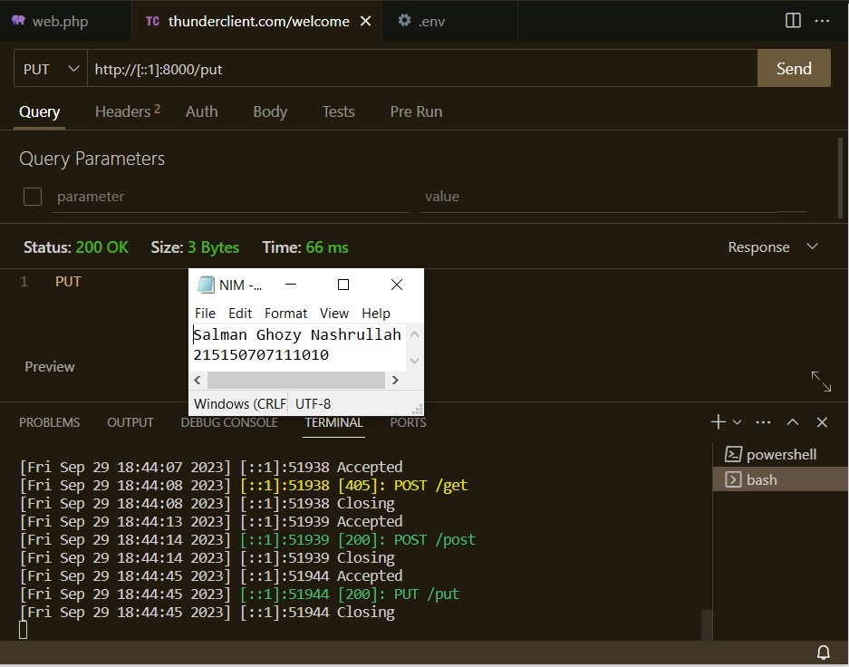

<h3>Langkah ke-3</h3>

Mengakses <i>url http://[::1]:8000/delete</i> pada <i>Thunder Client</i>

<h3>Langkah ke-4</h3>

Mengakses <i>url http://[::1]:8000/patch</i> pada <i>Thunder Client</i>

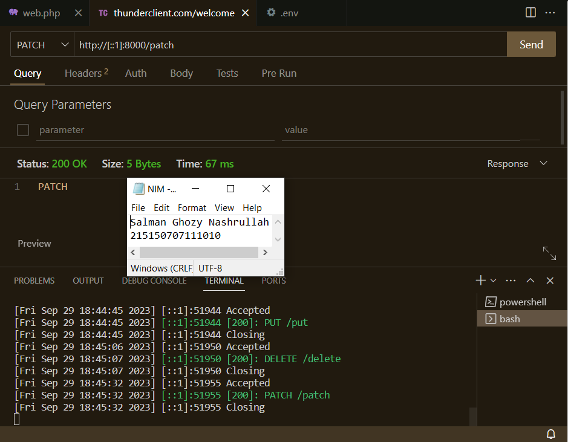

<h3>Langkah ke-5</h3>

Mengakses <i>url http://[::1]:8000/options</i> pada <i>Thunder Client</i>

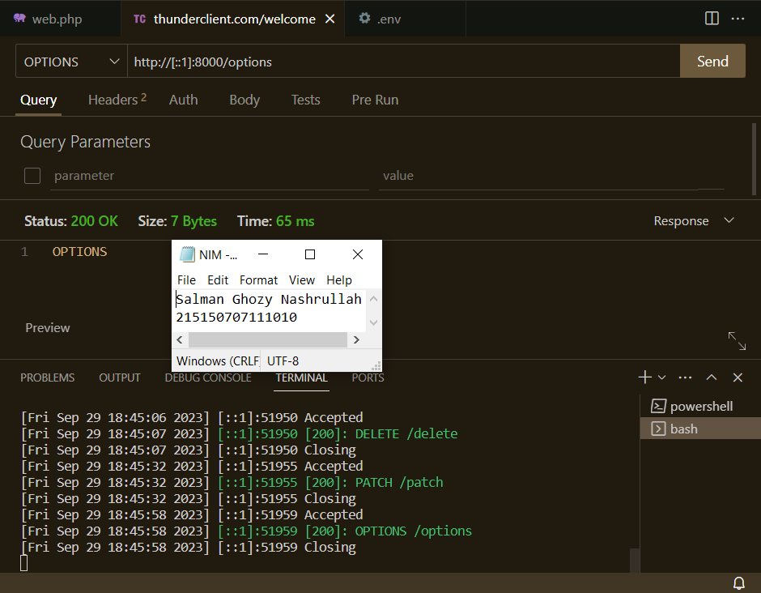

<h2>Migrasi Database</h2>
<h3>Langkah ke-1</h3>

melakukan migrasi <i>database</i> pastikan <i>server database</i> aktif kemudian pastikan sudah membuat <i>database</i> dengan nama <i>lumenapi</i>

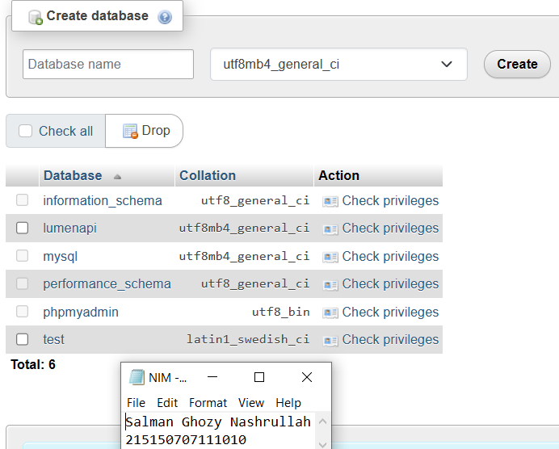

<h3>Langkah ke-3</h3>

ubah konfigurasi <i>database</i> pada <i>file .env</i> 

<i>DB_CONNECTION=mysql

DB_HOST=127.0.0.1

DB_PORT=3306

DB_DATABASE=lumenapi

DB_USERNAME=root

DB_PASSWORD= </i>

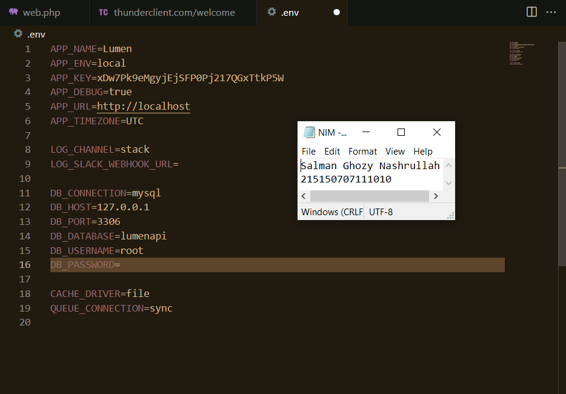

<h3>Langkah ke-4</h3>

Setelah mengubah konfigurasi pada <i>file .env</i>, kita juga perlu menghidupkan beberapa <i>library</i> bawaan dari <i>lumen</i> dengan membuka <i>file app.php</i> pada <i>folder bootstrap</i> dan mengubah baris ini,
<i>//$app->withFacades();

//$app->withEloquent();

Menjadi

$app->withFacades(); $app->withEloquent();</i>

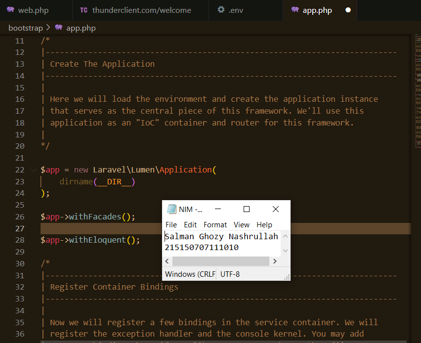

<h3>Langkah ke-5</h3>

Setelah itu jalankan <i>command</i> berikut untuk membuat <i>file migration
php artisan make:migration create_users_table #</i> membuat migrasi untuk tabel <i>users

php artisan make:migration create_products_table #</i> membuat migrasi untuk tabel <i>products</i>

Setelah menjalankan 2 <i>syntax</i> diatas akan terbuat 2 <i>file</i> pada <i>folder database/migrations</i> dengan <i>format YYYY_MM_DD_HHmmss_nama_migrasi</i>. Pada <i>file</i> migrasi kita akan menemukan fungsi <i>up() dan fungsi down(), fungsi up()</i> akan digunakan pada saat kita melakukan migrasi, <i>fungsi down()</i> akan digunakan saat kita ingin <i>me-rollback</i> migrasi

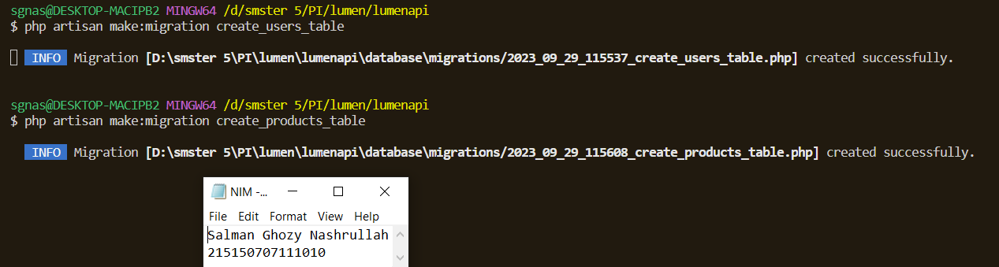

<h3>Langkah ke-6</h3>

Ubah fungsi up pada file migrasi <i>create_users_table public function up()

{

Schema::create('users', function (Blueprint $table) {

$table->id();

$table->timestamps();

$table->string('email');

$table->string('password');

});

}</i>

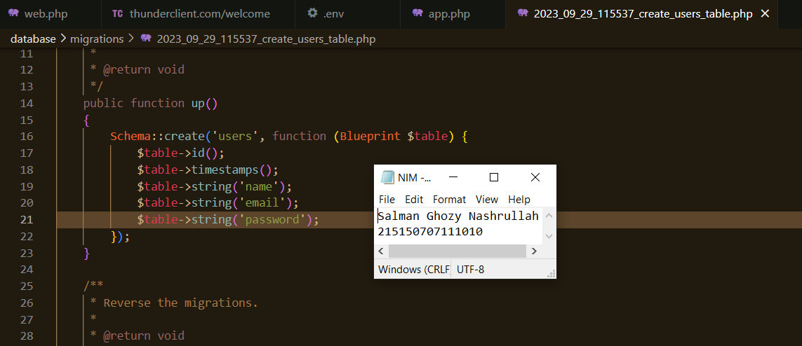

<h3>Langkah ke-7</h3>

 Ubah fungsi up pada file <i>migrasi create_products_table # sebelumnya
...
public function up()
{
Schema::create('products', function (Blueprint $table) {
$table->id();
$table->timestamps();
});
}
...
# diubah menjadi
...
public function up()
{
Schema::create('products', function (Blueprint $table) {
$table->id();
$table->timestamps();
$table->string('name');
$table->integer('category_id');
$table->string('slug');
$table->integer('price');
$table->integer('weight');
$table->text('description');
});
}
...</i>

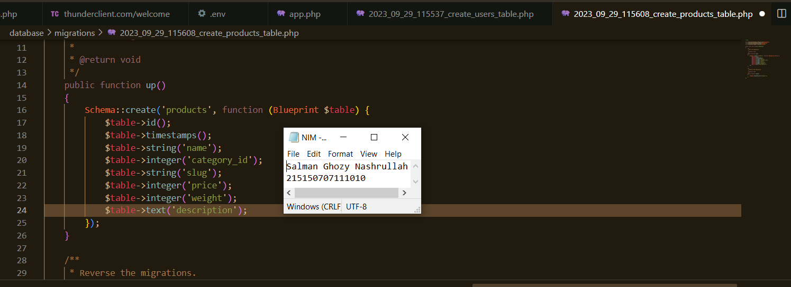

<h3>Langkah ke-8</h3>

Kemudian jalankan <i>command,

php artisan migrate</i>

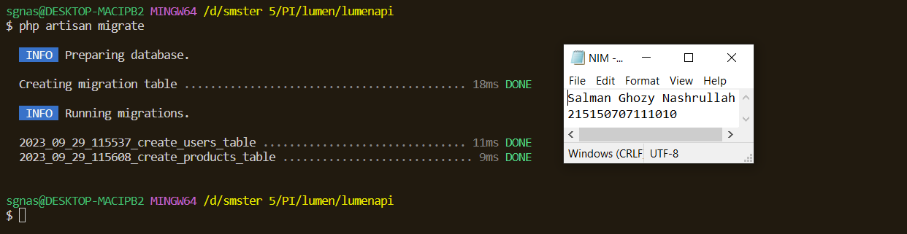

<h3>Langkah ke-9</h3>

Hasil dari database lumenapi yang dibuat sebelumnya dan ditampilkan di php my admin

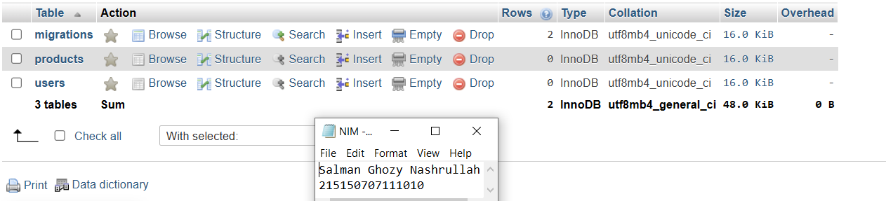